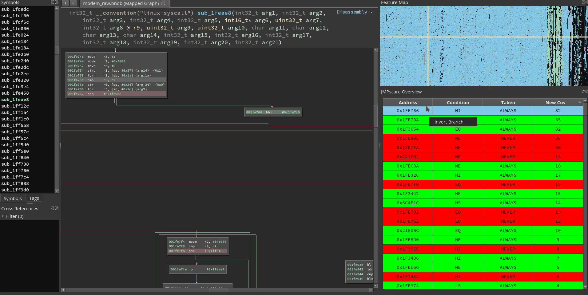

# JXMPscare
Toolkit for multi-execution jump coverage analysis: Analyze your fuzzing results by inspecting which jumps you are missing.

This repository includes the following components:
* Collection
    * Rust and Python modules to easily collect execution traces with [unicornafl](https://github.com/AFLplusplus/unicornafl)
* Analysis
    * tool to analyze multiple execution traces in order to find conditionals jumps which are always/never taken
    * works on any simple execution trace (file with one address per line)
    * supports x86_64 and ARM
* Plugins
    * Binary Ninja plugin to visualize analysis results
        * concise overview of road block jumps
        * instruction highlighting
        * easy navigation and auto-patching
    * Ghidra plugin WIP

For further information, please confer to the READMEs within each directory.
